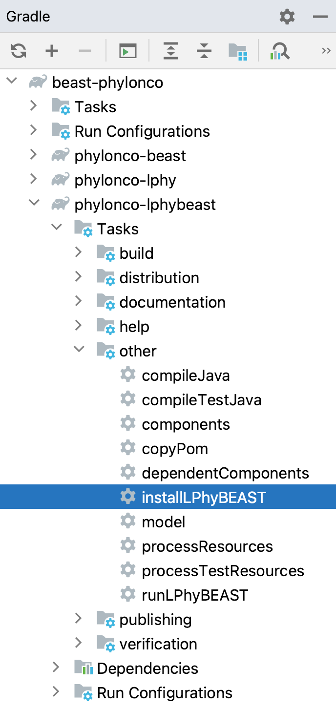

# Developer guide for Phylonco - LPhy and LPhyBEAST extension

## Read first

- [LPhy developer guide](https://github.com/LinguaPhylo/linguaPhylo/blob/master/DEV_NOTE.md)
- [LPhyBEAST developer guide](https://github.com/LinguaPhylo/LPhyBeast/blob/master/DEV_NOTE.md)

## For Phylonco developers

### Project structure

Phylonco project contains 3 subprojects:

1. phylonco-beast (BEAST package)
2. phylonco-lphybeast (LPhyBEAST extension, also BEAST package)
3. phylonco-lphy (LPhy extension)

Please note 1 and 2 will release as one BEAST package, 3 will release as a LPhy extension.

### Gradle build

1. How to update dependencies in Intellij, especially SNAPSHOT version.

https://github.com/LinguaPhylo/LPhyBeast/blob/master/DEV_NOTE.md#update-dependencies-in-intellij

Use this simple steps if LPhyBEAST's version is not changed.

2. How to update the LPhyBEAST dependency:

<a href="./InstallLPhyBEAST.png"></a>

LPhyBEAST is released as a `.zip` file into the [Maven repository](https://central.sonatype.com/namespace/io.github.linguaphylo),
because of the requirement of BEAST package framework.
Therefore, its update is not straight forward as other dependencies. 
When you want to upgrade LPhyBEAST to a newer version:

   i. Refresh Gradle Dependencies.

   ii. You need to run the task `installLPhyBEAST` inside the build of `phylonco-lphybeast` subproject __twice__.

The first time it downloads the zip file and unzip it, at the second time it loads all jar files into the system.
This process can be done either from command line below, or IntelliJ (screenshot on the right side).

```bash
./gradlew phylonco-lphybeast:installLPhyBEAST
```

   iii. Rebuild the project.

3. Run LPhyBEAST from Intellij for developers only:

Create an "Application" in "Run/Debug Configurations". An example is shown in the screenshot.

<a href="./RunLPhyBEAST.png"></a>

   i. Make sure the working dir has your lphy script.

   ii. Put the arguments like:

```arg
-vf YOUR_PATH/beast-phylonco/phylonco-lphybeast/version.xml,YOUR_PATH/beast-phylonco/phylonco-lphybeast/build/lphybeast/version.xml
ErrModel_Haploid.lphy
```

The 1st version.xml is for the LPhyBEAST extension (phylonco-lphybeast), the 2nd is from the LPhyBEAST core.
Both are required by BEAST2 framework.
